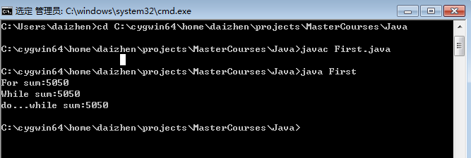

#First java code#
##Sum number from 1 to 100 using `for`, `while` and `do...while`##


```java

public class First
{

    public static void main(String[] args)
    {
        //Use 'for' to add number from 1 to 100
        int sum = 0;
        for(int i=1;i<=100;i++)
        {
            sum +=i;
        }

        System.out.print("For sum:"+sum);
        System.out.println();

        //While
        sum = 0;
        int i=1;
        while(i<=100)
        {
            sum +=i;
            i++;
        }

        System.out.print("While sum:"+sum);
        System.out.println();

        //do...while

        sum = 0;
        i=1;
        do
        {
            sum +=i;
            i++;
        }while(i<=100);

        System.out.print("do...while sum:"+sum);
        System.out.println();
    }
}


```
Compile .java to create .class file
> javac First.java

Run .class file 
> java First

And got the result in console:

>For sum:5050
>
>While sum:5050
>
>do...while sum:5050

