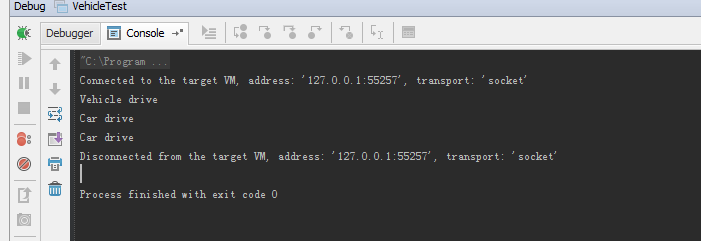
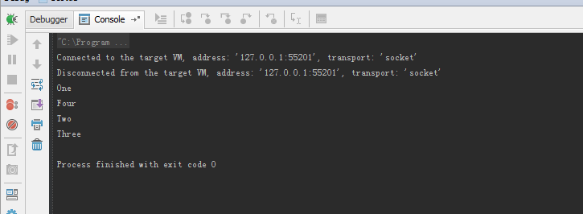

## 1.  VehicleTest.java ##

```java

class Vehicle
{
    public void drive()
    {
        System.out.println("Vehicle drive");
    }

    public static void main(String[] args) {
	// write your code here
    }
}

class Car extends Vehicle
{
    @Override
    public void drive()
    {
        System.out.println("Car drive");
    }
}

public class VehicleTest
{

    public  static void main(String[] args)
    {
        Vehicle v;
        Car c;
        v = new Vehicle();
        c = new Car();

        v.drive();
        c.drive();

        v = c;

        v.drive();
    }
}

```

Running result:

>Vehicle drive
>
>Car drive
>
>Car drive



Explain:

> For `v = new Vehicle();` it prints 'Vehicle drive', it's very straight forward
> 
> For `c = new Car();` it prints 'Car drive', because it calls to the overrided method.
> 
> The last one, althrough asigned c to v, the v still refer to a Car instance. So it calls to Car.drive to show 'Car drive'

## 2. Scottie.java ##

```java

class Mammal
{
    Mammal()
    {
        System.out.println("Four");
    }

    public void ears()
    {
        System.out.println("Two");
    }
}

class Dog extends Mammal
{
    Dog()
    {
        super.ears();
        System.out.println("Three");
    }
}
public class Scottie extends Dog
{
    public static void main(String[] args)
    {
        System.out.println("One");
        Scottie h = new Scottie();
    }
}

```

running result:
>One
>
>Four
>
>Two
>
>Three

Explain:

Java start running from main function, and first print 'One', and then try to call Scottie constructor to create a instance. It always call its parent constructor first, so go to `Dog()` and dog is extended from `Mammal()` and then print 'Four'.  And then call
```java
        super.ears();
        System.out.println("Three");
```
to print 'Two' and 'Three'.


